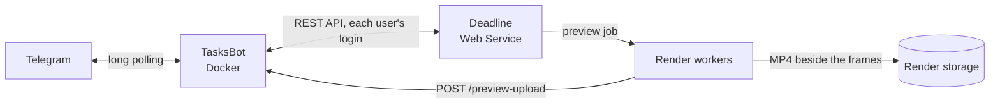

<p align="center">
  
</p>
<h1 align="center">TasksBot</h1>

A self-hosted Telegram bot for [Thinkbox Deadline](https://aws.amazon.com/thinkbox-deadline/) render farms.
Built with Python 3.13, aiogram, and SQLite.

- Browse jobs, tasks, and workers; suspend, resume, requeue, or delete jobs from the chat.
- Get previews of renders while they run: a farm worker turns the EXR frames rendered so far
  into an MP4 with the ACES view transform and sends it to the chat.
- See an ETA drawn from the whole frame range, and get alerts for errors that need a person.

Everyone signs in with their own Deadline account, and the bot acts with that account's rights.

## How it works



The bot connects out to Telegram and to the Deadline REST API. It needs one inbound port, 8081
by default, for preview uploads from workers and optional farm events.

| Area | What it does |
| --- | --- |
| Jobs | Paged list grouped by batch. A job card shows progress, frames, time spent rendering, ETA, and errors, with Suspend, Resume, Requeue, Resume failed, and Delete. |
| Tasks and workers | Per-task table with run times; worker list with live status and an Enable/Disable toggle. |
| Previews | From the chat on the frames rendered so far, or automatically when a render finishes. One per render run; a requeued run gets a new one. A single frame arrives as a PNG. |
| ETA probing | Renders a few chunks spread across the frame range first, so the ETA comes from a cost curve over the whole shot rather than from its first frames. |
| Error alerts | Redshift licensing, scenes saved on a local `C:` drive, scenes the farm cannot open, and plugin sandbox failures, each with advice on the fix. |

## Deploy with Docker

Requires Git, Docker with Compose, a bot token from **@BotFather**, and a Deadline Web Service
the bot can reach, for example the one the Remote Connection Server hosts. In Repository
Options → Web Service Settings, turn **Require Authentication** on and **Allow Empty Passwords**
off: the bot has no user list of its own, so the Web Service login is its only access check.

```bash
git clone https://github.com/dcip3/DCIP3.TasksBot.git
cd DCIP3.TasksBot
cp .env.example .env
```

In `.env`, set `TELEGRAM_BOT_TOKEN`, `DEADLINE_API_URL`, and `ENCRYPTION_KEY`; the bot refuses to
start without a valid key. Generate one with:

```bash
python3 -c "import base64, os; print(base64.urlsafe_b64encode(os.urandom(32)).decode())"
```

For previews, also set `PREVIEW_UPLOAD_ENABLED=True` and point `PREVIEW_UPLOAD_URL` at this host
as the workers see it, for example `http://bot-host:8081`. The upload server speaks plain HTTP:
let only the render network reach it, or put it behind a TLS reverse proxy and use an `https`
URL. Then start the bot:

```bash
docker compose up -d --build
docker compose logs -f --tail=100
```

Open the bot in Telegram, send `/login`, and enter your Deadline user name and the Web Service
password from your Deadline user settings.

`./data/` holds the SQLite database and temporary files and survives container recreation.
Back up `data/app.db` while the bot is stopped, and keep `ENCRYPTION_KEY` with it: without
the key, stored passwords cannot be decrypted and everyone has to `/login` again. Run only
one bot instance per token.

To update an existing installation:

```bash
git pull --ff-only
docker compose up -d --build
```

<details>
<summary>Optional: GitHub Actions deployment</summary>

[deploy.yml](.github/workflows/deploy.yml) deploys the tip of `main` over SSH once the
repository checks pass. Prepare a working installation on the server and add the repository
secrets `VDS_HOST`, `VDS_USER`, `VDS_SSH_KEY`, and `DEPLOY_PATH` (the absolute path of that
installation), plus `VDS_HOST_FINGERPRINT` to pin the server's host key: the `SHA256:...` value
from `ssh-keygen -lf /etc/ssh/ssh_host_ecdsa_key.pub` on the server. The SSH user needs
access to that directory, Git, and Docker; `.env` and `data/` stay on the server. The deployment
points the checkout at this repository over HTTPS and resets it to the commit that passed the
checks, so keep local changes out of that directory. Compose output stays in `deploy.log` on the
server. In a fork, change the repository name in the workflow's `if:` condition.

</details>

## Set up workers for previews

A preview is a Deadline `CommandLine` job that runs [a Python script](scripts/deadline_preview_worker.py)
on a worker. Any worker that may pick one up needs:

| Requirement | Why |
| --- | --- |
| Python 3 with OpenColorIO 2, OpenEXR, NumPy, and Pillow | Reads the EXR frames and applies the color transform |
| `ffmpeg` and `ffprobe` on `PATH` | Encodes the MP4, with NVENC when ffmpeg offers it |
| Read access to the frames, write access to the folder one level above them | The preview is saved beside the render's output folder |
| An OCIO config the workers can read, set in `PREVIEW_OCIO_REMOTE_CONFIG` | Without it, previews skip the ACES view transform |
| HTTP access to `PREVIEW_UPLOAD_URL` | Sends the finished preview to the bot |

On Windows workers, run [worker_setup.bat](scripts/worker_setup.bat): it installs Python 3.11
when no 3.11 is found and the Python packages into every interpreter it finds. The bot also
sends both setup scripts from **Settings → Worker Setup**. Install `ffmpeg` separately.

When `PREVIEW_UPLOAD_ENABLED` is off, the bot reads the finished preview from the render folder
itself, which works only when the bot sees the render storage at the same path as the workers.

## Configuration

Settings are read from environment variables or `.env`; environment variables take precedence.

| Variable | Default | Purpose |
| --- | --- | --- |
| `TELEGRAM_BOT_TOKEN` | Required | Telegram bot token from @BotFather |
| `DEADLINE_API_URL` | Required | Deadline REST API without a trailing slash, e.g. `https://rcs.example:4434/api` |
| `ENCRYPTION_KEY` | Required | Fernet key that encrypts stored Deadline passwords |
| `DEADLINE_TLS_VERIFY` | `True` | Set `False` when the Deadline certificate is self-signed |
| `PREVIEW_UPLOAD_ENABLED` | `False` | Start the HTTP server that receives previews from workers |
| `PREVIEW_UPLOAD_URL` | Empty | URL the workers send previews to; `/preview-upload` is added when it has no path |
| `PREVIEW_UPLOAD_PORT` | `8081` | Port of that server; the Compose file publishes the same port |
| `PREVIEW_OCIO_REMOTE_CONFIG` | Empty | OCIO config path as the workers see it |
| `PREVIEW_MAX_DIMENSION` | `1920` | Longest side of a preview in pixels; `0` keeps the render size |

<details>
<summary>All other settings</summary>

| Variable | Default | Purpose |
| --- | --- | --- |
| `PREVIEW_INPUT_SPACE` | `ACEScg` | OCIO color space of the frames |
| `PREVIEW_DISPLAY` / `PREVIEW_VIEW` | `sRGB` / `ACES 1.0 SDR-video` | OCIO display and view |
| `PREVIEW_APPLY_COLOR_TRANSFORM` | `True` | Turns the OCIO transform off for everyone when `False` |
| `PREVIEW_ATTACH_OCIO_CONFIG` | `False` | Send `OCIO_CONFIG_PATH` with each preview job instead of using a shared path |
| `OCIO_CONFIG_PATH` | `data/config.ocio` | OCIO config on the bot host |
| `PREVIEW_PYTHON_EXECUTABLE` | `python` | Python on the workers; for Windows paths the `py` launcher is tried first |
| `FFMPEG_PATH` | `ffmpeg` | ffmpeg on the workers and on the bot host; keep the default unless both share the path |
| `PREVIEW_TEMP_DIR` | Worker temp folder | Scratch folder for previews on the workers |
| `PREVIEW_PRESUBMIT_ENABLED` | `True` | Queue automatic previews as Pending dependencies of the running render |
| `PREVIEW_PRESUBMIT_INPUT_WAIT` | `3600` | Seconds a preview waiting on its render gives the frames to appear |
| `PREVIEW_UPLOAD_BIND_HOST` | `0.0.0.0` | Address the upload server listens on |
| `PREVIEW_UPLOAD_INSECURE` | `False` | Workers skip certificate checks for an `https` upload URL |
| `PREVIEW_UPLOAD_TOKEN_TTL` | `604800` | Lifetime of a one-time upload token, in seconds |
| `PREVIEW_UPLOAD_MAX_MB` | `100` | Largest upload accepted |
| `PREVIEW_UPLOAD_DELIVERY_MAX_ATTEMPTS` | `10` | Attempts to send a received preview to Telegram |
| `PREVIEW_UPLOAD_RECOVERY_INTERVAL_SECONDS` | `120` | How often failed deliveries are retried |
| `PREVIEW_UPLOAD_DELIVERY_WAIT_SECONDS` | `600` | Once an upload token has expired, seconds after the preview job completes to keep waiting for its upload |
| `DEADLINE_EVENT_SECRET` | Empty | Enables `POST /deadline-event` on the upload server, which needs `PREVIEW_UPLOAD_ENABLED=True` (see below) |
| `JOB_WATCHER_INTERVAL_NORMAL` | `60` | Seconds between farm polls; shorter while alerts or auto previews are on |
| `JOB_WATCHER_INTERVAL_PREVIEW` | `5` | Seconds between polls while a preview job runs |
| `SCHEDULER_TIMEZONE` | `UTC` | Time zone of the cleanup and housekeeping schedule |
| `SQLITE_DB_PATH` | `data/app.db` | SQLite database |
| `TEMP_DIR` | `data/temp` | Received uploads and scratch files |
| `CONV_DIR` | `data/conv` | Legacy scratch folder; the bot only empties it |

A Deadline event plugin can make the bot react to jobs at once instead of at the next poll: it
posts `{"event": "...", "job_id": "...", "job_name": "..."}` with the header
`X-Deadline-Event-Secret`. `job_finished` releases previews waiting on that render, `job_requeued`
lets its next run get a new preview, and any other event just wakes the watcher. The plugin is not
part of this repository; polling works without it.

`data/config.ocio` is the default OCIO config that ships with Redshift, included for convenience.
Point `OCIO_CONFIG_PATH` and `PREVIEW_OCIO_REMOTE_CONFIG` at your own config if you use another one.

</details>

## Using the bot

| Command | Purpose |
| --- | --- |
| `/start` | Show the main menu: 📂 Jobs, 🖥️ Workers, ⚙️ Settings |
| `/login` | Sign in with a Deadline user name and password, or replace the stored ones |
| `/logout` | Delete the stored credentials and personal settings |
| `/help` | List buttons and commands |

Each user chooses in **Settings**:

| Setting | Options | Default |
| --- | --- | --- |
| Error Alerts | On or off, and whether to scan all jobs or only your own | Off |
| Preview → Auto Preview | On or off, for all jobs or only your own | Off |
| Preview → Post Effects | ACES view transform, camera LUT, and color controls, each on or off | All on |
| Preview → Default Worker | Auto (the render's machine list), a named worker, or ask every time | Ask |
| ETA Probing | Off, your jobs only, or all jobs (needs the right to suspend other users' tasks) | Your jobs |

An error alert goes to the job's owner and, for machine errors, to the user whose Deadline login
matches the worker's name. ETA probing briefly holds back the queued tasks of a new render so that
chunks spread across its frame range render first, and releases them within 90 minutes at most.

## Run locally

Requires **Python 3.13**; with `ffmpeg` on `PATH`, oversized previews are compressed before sending.
Clone the repository and configure `.env` as above, then:

```bash
python3.13 -m venv .venv
source .venv/bin/activate
python -m pip install -r requirements.txt
python main.py
```

<details>
<summary>Windows (PowerShell)</summary>

```powershell
py -3.13 -m venv .venv
.\.venv\Scripts\python.exe -m pip install -r requirements.txt
.\.venv\Scripts\python.exe main.py
```

</details>

No license has been chosen yet; public visibility alone does not grant permission to reuse the code.

[Contributing & checks](CONTRIBUTING.md) · [Security](SECURITY.md)
